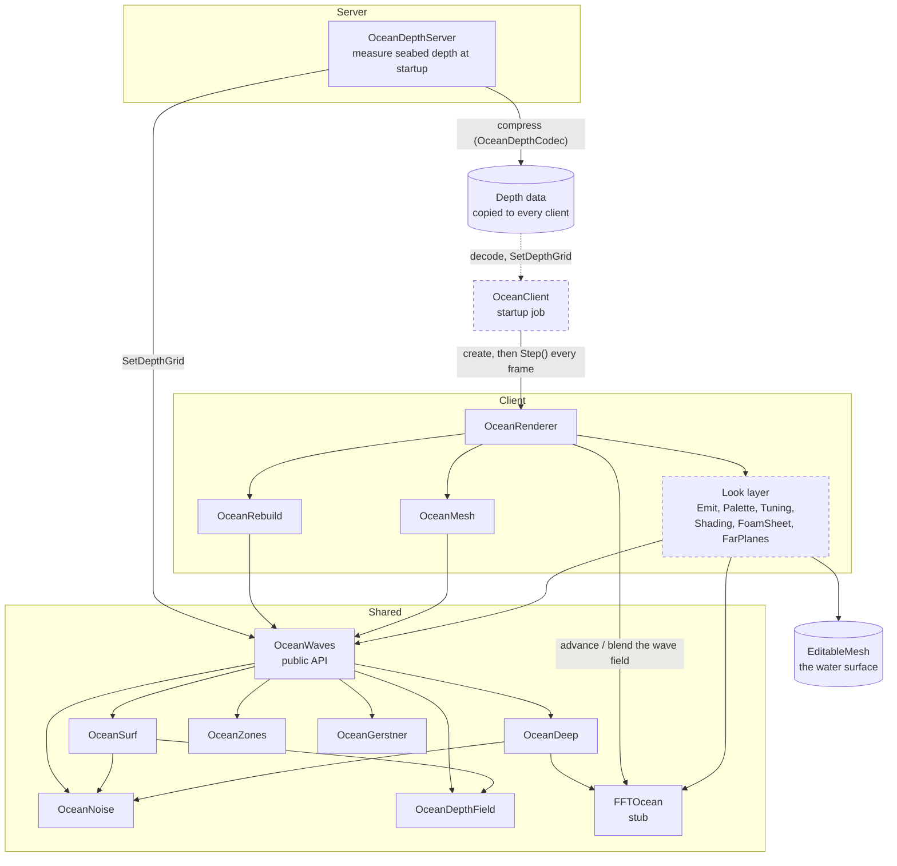

# Ocean Sample

Here's a look at a portion of the ocean system I've developed for a project I'm involved with, built on the Roblox engine. This snippet represents about 45% of the total ocean code, comprising roughly 2,000 lines out of a total of 4,250 (excluding comments). I've excluded elements responsible for the water's visual appearance, the core wave simulation, and the initialization code, meaning it won't function as a standalone piece. While I intend to keep the complete ocean system proprietary, **I'm more than willing to discuss it in detail during an interview.**

## The idea

The underlying concept was to create an ocean experience that is identical for every player, without requiring the server to broadcast wave data. Server resources are extremely valuable when accommodating numerous players on limited hardware. Therefore, the wave generation is entirely dependent on world position and the current time. Every machine reads the same shared clock and works out the same water on its own, so nothing needs to be synced. The primary hurdle in this project was ensuring this process is efficient enough to execute every frame on a player's local machine.

## What it does

- **One mesh that follows the camera.** It is dense near the camera and surrounded by rings that get coarser with distance, which is the idea behind Losasso and Hoppe's geometry clipmaps. The rings stay snapped to a fixed grid in the world, which stops the water from swimming and shimmering as you move.
- **A fixed cost per frame.** Each ring updates at its own rate, and its work is spread across several frames under a time budget so there are no spikes.
- **Caching instead of recomputing.** A vertex's values only depend on where it is in the world, so when the rings shift, most vertices can take their values from whichever vertex used to sit in that spot. Only the newly uncovered strip gets computed: about 9% of the mesh for a straight move and 17% for a diagonal one.
- **Shorelines worked out automatically.** When the server starts, it measures the depth of the seabed once and shares it. From that, every machine knows where the land is, how far each point is from the shore and where the waves should break.

## A few key terms

You don't need to know Roblox to follow this, but a few engine terms come up:

- **Server and client:** the game runs on one server and on each player's machine (a client). Everything visual runs on the clients.
- **Replication:** Roblox automatically copies objects the server creates to every client. This is how the depth data reaches players without any custom networking.
- **Part, tag and attribute:** a part is a basic 3D block placed in the level. A tag is a label on an object (e.g. `Ocean`) that code can look up, and an attribute is a named value stored on an object.
- **Raycast:** firing an invisible line from a point in a direction and getting back the first thing it hits. Here it is used to find the seabed.
- **EditableMesh:** a Roblox mesh whose vertices can be moved from code every frame. The water surface is one of these.
- **Stud:** Roblox's unit of distance (roughly 0.28 m).
- **Server clock:** `workspace:GetServerTimeNow()`, a time value every client agrees on. The waves are calculated from it.

## How modules find each other

Files load each other in two ways:

- `require(script.X)` loads a file's own sub-files.
- `shared("ModuleName")` loads anything else. `shared` comes from the project's framework (not included) and returns a loaded module by its name, e.g. `shared("OceanWaves")`. To use these files somewhere else, you would swap those calls for normal `require` paths.

`OceanDepthServer` is a "job" in the project's framework, which means the framework calls its `StartAsync()` once when the server starts.

## What's included

```
ocean-sample/
  Shared/                     runs on the server and every client
    Maid.lua                  cleanup helper (from Nevermore, see Credits)
    OceanDepthCodec.lua       compresses the depth grid into text (run-length encoding + base64)
    FFTOcean/
      init.lua                stub: same interface as the real simulation, outputs a flat sea
      FFTOceanSpectrum.lua    stub: only the wave direction (WindX / WindZ)
    OceanWaves/
      init.lua                the public API: "how high is the water here, right now?"
      OceanDeep.lua           open sea: simulated waves scaled to studs, calmer near land, steeper in shallows
      OceanSurf.lua           near the shore: breaking waves and the water running up and down the beach
      OceanNoise.lua          fixed-seed noise that bends wave crests and varies their size
      OceanDepthField.lua     the depth grid: water depth, distance to shore, "is this land?"
      OceanZones.lua          tagged parts that make waves bigger or smaller in an area
      OceanGerstner.lua       a classic wave formula, only used to size the mesh's bounds when it is built
  Client/                     runs on each player's machine
    OceanRenderer/
      init.lua                the renderer: owns the mesh and rings, follows the camera, schedules work each frame
      OceanMesh.lua           builds the triangle layout (centre patch + rings)
      OceanRebuild.lua        works out each vertex's fixed values and reuses them when the grid shifts
  Server/
    OceanDepthServer.lua      measures the seabed depth once at startup and shares it
```

## How it fits together

The dashed boxes are not included in this sample.



### At startup

1. **Server:** `OceanDepthServer` finds the part tagged `Ocean`, which marks sea level and the area the sea covers. It fires a raycast straight down every 8 studs across that area and stores one byte per cell: `0` for land, otherwise how deep the water is. Any water that is completely enclosed by land is turned into land as well, so inland pools don't get ocean waves. The grid is then compressed into text and placed somewhere it gets copied to every client.
2. **Client:** the startup job (not included) builds the renderer straight away and treats everything as deep water. When the depth data arrives, it is decoded and passed to `OceanWaves.SetDepthGrid`, the renderer rebuilds and the shorelines appear.

### Every frame

1. Within a time budget, the wave simulation moves forward a step if one is due.
2. The rings follow the camera. When the camera crosses a grid cell the rings shift by one cell, and `OceanRebuild` copies each vertex's fixed values over from whichever vertex used to sit on that world position, so only the new strip is computed.
3. Each ring, at its own rate, takes a frozen copy of the wave field so it never mixes two moments in time. The look layer (not included) then writes positions, normals and colours to the mesh, spread across several frames.

## What's left out

| Not included | What it does | Why |
|---|---|---|
| `OceanRenderer/OceanEmit.lua` | The per-frame pass that writes every vertex: samples the waves, adds the surf, applies colour and foam | Part of the look layer, which I'm keeping closed |
| `OceanRenderer/OceanPalette.lua` | Every water colour, precomputed (depth, wave height, foam, storms) | Look layer |
| `OceanRenderer/OceanTuning.lua` | Every visual setting in one file (ring sizes, colours, foam, budgets). `init.lua` and `OceanRebuild.lua` read from it | Look layer |
| `OceanRenderer/OceanShading/` | A scrolling, generated normal map for small ripples | Look layer |
| `OceanRenderer/OceanFoamSheet.lua` | Foam texture overlays above the near water | Look layer |
| `OceanRenderer/OceanFarPlanes.lua` | Flat planes that fill the horizon past the last ring | Look layer |
| `FFTOcean/` (real) | The wave simulation: an FFT-based ocean spectrum, run in stages across frames | Built on a purchased FFT ocean system that isn't mine to share. I've replaced it with a stub that has the same interface, and any repeatable wave function can be plugged into its `computeField` |
| `OceanClient.lua` | Starts the renderer, passes it the depth data, steps it every frame and darkens the water in storms | Tied to the rest of the game (weather, server types) |
| `OceanAmbienceClient.lua` | Sea and shore ambient sound | A separate feature |
| `OceanSplashClient.lua` | Wave-crash and spray effects | A separate feature |
| Framework | The `shared(...)` loader and job system | Not part of the ocean |

## Credits

These are the papers and people whose work this builds on:

- Frank Losasso and Hugues Hoppe, *Geometry Clipmaps: Terrain Rendering Using Nested Regular Grids*, ACM Transactions on Graphics 23(3) (SIGGRAPH 2004). The camera-following ring mesh in `OceanMesh` and `OceanRenderer`.
- Jerry Tessendorf, *Simulating Ocean Water*, SIGGRAPH course notes (1999-2001). The FFT ocean model behind the open sea.
- W. T. Cochran, J. W. Cooley, D. L. Favin, H. D. Helms et al., *What Is the Fast Fourier Transform?*, IEEE Transactions on Audio and Electroacoustics 15, pp. 45-55, June 1967, which describes Stockham's self-sorting FFT. The algorithm in the simulation core (not included).
- Franz Josef Gerstner, *Theorie der Wellen* (1802), for the trochoidal wave, Alain Fournier and William T. Reeves, *A Simple Model of Ocean Waves*, SIGGRAPH 1986, and Mark Finch, *Effective Water Simulation from Physical Models*, GPU Gems (2004), chapter 1. The wave sum in `OceanGerstner`.
- Azriel Rosenfeld and John L. Pfaltz, *Sequential Operations in Digital Picture Processing*, Journal of the ACM 13(4), pp. 471-494, 1966. The two-pass distance transform behind distance-to-shore in `OceanDepthField`.

Code from other people:

- `Shared/Maid.lua` is from [Nevermore](https://github.com/Quenty/NevermoreEngine) by James Onnen (Quenty), MIT License.
- The FFT simulation core (not included) comes from a purchased FFT ocean system.

Everything else is my own work. Some of the comments in the code are AI-assisted.
